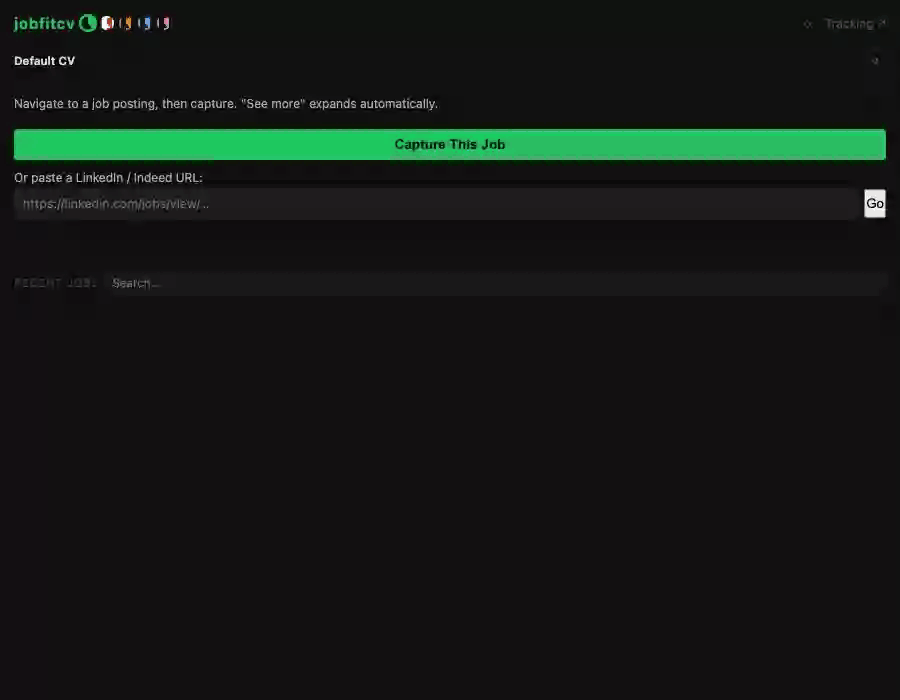

# jobfitcv

A local-first job application assistant: a Chrome extension captures job postings, a FastAPI backend scores your resume content against each job and assembles a tailored resume, and a full review UI lets you audit and adjust every selection before it goes out.

Runs entirely on your machine. Your resume, work history, and job data never leave your filesystem unless you explicitly point an LLM feature at a cloud provider.



---

## What It Does

**Capture** — one click captures any job posting from any website. Strips nav/footer noise, deduplicates re-visits by URL and text fingerprint.

**Score + Generate** — sentence-transformer embeddings rank your resume "chunks" (individual bullets — one experience entry, one project, one skill group) against the job description. The highest-scoring relevant chunks are assembled into a tailored resume, rendered as HTML and PDF.

**Review** — a full chunk-review UI shows exactly why each chunk was selected or cut (score breakdown, quota/threshold flags), lets you toggle chunks in or out, reorder bullets, and re-run generation from your adjusted selection — no guessing why the pipeline picked what it picked.

**Fill** — one click fills application form fields (name, email, phone, LinkedIn, GitHub, work history, education) on Greenhouse, Lever, or any site with labeled fields, using React/Vue-compatible native event dispatch. Sensitive/EEO fields are deliberately excluded from auto-fill.

**Track** — a full-tab tracking page shows every captured job with status, notes, and output links.

**Cover letter** — generates a tailored cover letter per job from your resume chunks and the job description, in your choice of tone.

See [`docs/DEMO.md`](docs/DEMO.md) for a full feature-by-feature walkthrough.

---

## Setup

```bash
git clone <this-repo>
cd jobfitcv
./install.sh
```

`install.sh` creates a Python virtualenv (`kratos/`), installs dependencies, initializes the SQLite DB, installs Playwright's Chromium (for local PDF generation), and generates extension icons.

Then, copy `.env.example` to `.env` first (keeps the comments/structure), and run the guided setup:

```bash
cp .env.example .env
kratos/bin/python scripts/setup_wizard.py
```

This walks through the API key, server port (writes to both `.env` and `extension/config.js` so they can't drift out of sync), which LLM provider each feature uses, your contact info, and your resume content (from a placeholder template or auto-generated from existing chunks) — safe to re-run any time, existing values show as defaults. Not required — you can edit `.env` and `data/*.json` by hand instead — but it's the fastest path to a working setup.

**Don't confuse it with the *other* wizard**: `http://localhost:8000/wizard` (a web page, only reachable once the server is running) is for creating individual resume chunks from plain-language descriptions — a different tool for a different job. `scripts/setup_wizard.py` is the one-time CLI onboarding flow; the web wizard is for ongoing resume content editing.

Then:
1. `./start.sh` — starts the API at `http://localhost:8000`
2. Load `extension/` as an unpacked extension in Chrome (`chrome://extensions` → Developer mode → Load unpacked)

---

## Architecture

```
Job posting (any site)
  │  Chrome extension: capture + clean
  ▼
POST /jobs/ingest ──────────────► taxonomy classification (track/focus)
  │                                role-match badge (title vs target roles)
  ▼
LLM: structured JD summary ─────► stored as Job.raw_text
  (short, keyword-dense — this   (feeds embedding, keyword scoring,
   is what every downstream       Ollama assess, and rewrite hooks —
   step actually consumes)        never the full verbatim posting)
  │
  ▼
POST /jobs/{id}/generate
  │
  ├─► embed_text(raw_text) ──────► job embedding vector
  │
  ├─► score every active resume chunk
  │     0.72 × cosine similarity
  │   + 0.13 × keyword overlap
  │   + 0.15 × priority
  │     → per-type threshold + quota + group-cap → selected set
  │
  ├─► (optional, off by default) LLM rewrite pass per bullet for ATS alignment
  │
  ├─► render → resume.md / resume.html / resume.pdf
  │
  └─► outputs/resumes/{job_id}/   (one job, one directory, always)
        ├── generated/            final HTML/PDF/markdown
        ├── edited/                hand-edited markdown, re-renderable
        └── rewrites/              rewrite audit snapshots

Chunk Review UI ◄──── scored_pool (full ranked list, stored at generation time)
  │  toggle / reorder / re-assess (Ollama) / synthesize summary
  ▼
Apply Selection ─────► rebuilds artifacts from your adjusted selection
```

**Core pipeline modules:** `app/generation/matcher.py` (scoring), `app/core/embedder.py` (embeddings), `app/jobs/taxonomy_classifier.py` (track detection), `app/generation/variant_manager.py` (per-job output directories), `app/generation/resume_builder.py` + `app/generation/renderer.py` (assembly and rendering).

**Full internals reference:** [`docs/INTERNALS.md`](docs/INTERNALS.md) — scoring formula details, threshold rationale, known gaps.
**API surface, extension architecture, and data locations:** [`docs/CAPABILITIES.md`](docs/CAPABILITIES.md).

---

## LLM Configuration

Every LLM-touching feature — JD summarization, cover letters, the chunk wizard, chunk-review summary synthesis, the optional experience.json auto-generate in `setup_wizard.py`, and the (off-by-default) rewrite pipeline — is provider-agnostic and independently configurable. Each defaults to Anthropic; none require it.

```
LLM_PROVIDER / LLM_MODEL                    # rewrite pipeline (inert unless enabled)
CL_PROVIDER / CL_MODEL                      # cover letters
JD_SUMMARY_PROVIDER / JD_SUMMARY_MODEL      # JD summarization at ingest
WIZARD_PROVIDER / WIZARD_MODEL              # plain-language chunk creation
SUMMARY_SYNTH_PROVIDER / SUMMARY_SYNTH_MODEL # chunk-review summary synthesis
EXPERIENCE_PROVIDER / EXPERIENCE_MODEL      # setup_wizard.py experience.json auto-generate
```

Each pair accepts `anthropic` (needs `ANTHROPIC_API_KEY`), `openai` (any OpenAI-compatible endpoint — OpenRouter, Groq, Together, etc. — needs `OPENAI_API_KEY`), or `ollama` (local, no key, needs a pulled model). See `.env.example` for the full list and defaults.

Embeddings are separate from all of this — `sentence-transformers` (`BAAI/bge-base-en-v1.5`) runs self-contained, no external service or API key needed.

The chunk-review "Assess Fit" feature calls Ollama directly (`mistral:latest`, fallback `qwen2.5-coder:7b`) — a local model is expected to be running for that specific feature.

---

## Customizing for Your Field

This ships tuned for security/IT job searches, but nothing about the matching pipeline is field-specific — the following are opt-in, none required to run the tool:

- **Job tracks** — the 6 shipped tracks (`data/taxonomy/`) classify incoming postings for security/IT. Run `kratos/bin/python scripts/taxonomy_builder.py` for a guided flow to add or replace tracks for a different field (it can hand you a prompt template to draft the track description with any AI chat tool, if you're not sure where to start).
- **Role-match badge targets** — `data/job_targets.json` ships with a small example set; edit it directly with whatever role titles you're actually targeting.
- **Resume template** — see [Stack](#stack) below for adding your own Jinja2 template.

---

## Stack

| Layer | Technology | Rationale |
|-------|-----------|-----------|
| Backend | FastAPI + uvicorn | Fast, typed, async-ready, auto-docs |
| Database | SQLite via SQLAlchemy | Zero-config, local, portable |
| Embeddings | sentence-transformers (`BAAI/bge-base-en-v1.5`) | Self-contained, no service dependency |
| PDF | Playwright | Full-fidelity HTML-to-PDF, same path locally and in Docker |
| Templates | Jinja2 HTML | Version-controlled, human-editable |
| Extension | Chrome MV3 | Current Web Store standard |
| LLM | Anthropic / OpenAI-compatible / Ollama | Provider-agnostic per feature, see above |

Resume templates are plain Jinja2 HTML under `templates/` — two ship with the repo (`technical_compact`, `modern`). Add your own by dropping a new folder there and pointing `TEMPLATE_NAME` in `app/core/config.py` at it; no code changes needed.

---

## Docker

```bash
cd deploy
docker-compose up -d
```

Builds a self-contained image — embedding model and Chromium are both pre-fetched at build time, so no network access is needed at runtime for either. `data/` and `outputs/` are mounted as volumes; `.env` is passed via `env_file`. See [`deploy/DEPLOY.md`](deploy/DEPLOY.md) for the full breakdown of what's baked in vs. mounted, and the (currently manual) path to a cloud deployment.

---

## Security and Privacy

- No telemetry, no analytics, no usage tracking
- All user data stays in `data/` on the local filesystem, gitignored by default
- Extension communicates only with `localhost:8000` — no internet requests from the extension itself
- Content script is declarative and dormant — only acts on messages from the extension's own service worker
- Permissions: `activeTab`, `sidePanel`, `scripting`, `windows` (popup-based URL capture only, closes itself automatically)
- API keys stored in `.env`, gitignored, never logged or transmitted by the extension

Full permission rationale, data flow inventory, and threat model: [`docs/SECURITY.md`](docs/SECURITY.md).

---

## Known Limitations

- Resume chunks require manual authoring or the in-app wizard — no import from existing resume file formats yet
- `content_scripts` matches `<all_urls>` (needed since job postings can appear on any domain, including company career pages) — acceptable for personal/local use; scoping to specific job board domains is a prerequisite for any Chrome Web Store submission
- The rewrite pipeline (per-bullet LLM rewriting for ATS alignment) exists and is provider-agnostic but is off by default (`ENABLE_REWRITES=False` in `app/core/config.py`) pending more real-world validation of output quality
- DOM form-fill on non-Greenhouse/Lever sites is best-effort — field identification via label/name/placeholder heuristics, may need updates as sites change their markup

---

## License

[PolyForm Noncommercial 1.0.0](LICENSE) — free to use, modify, and share for any noncommercial purpose. Commercial use requires a separate license from the author.
