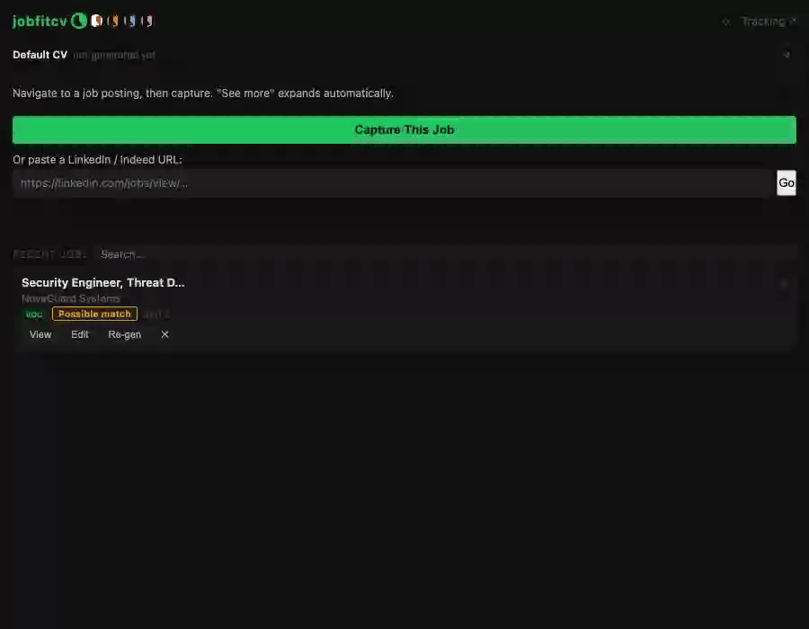
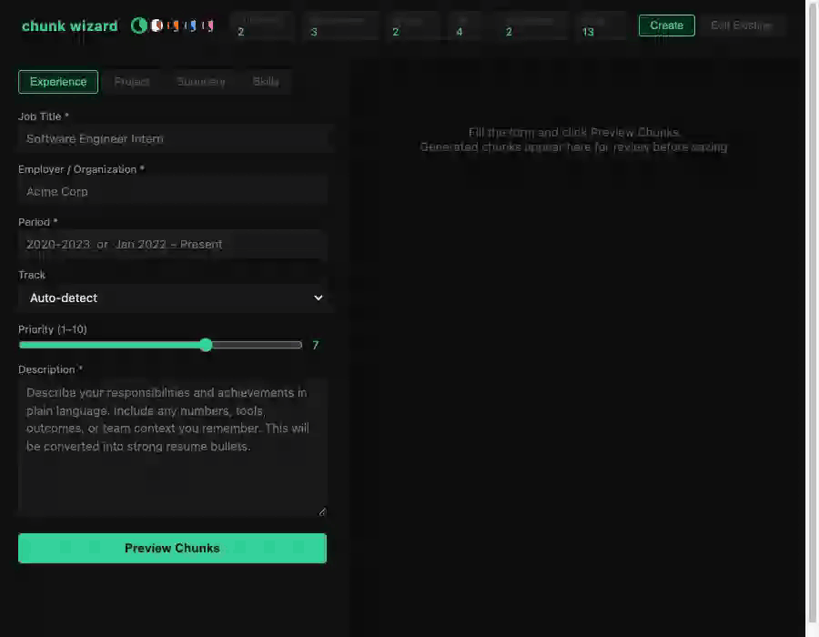

# jobfitcv — Demo Walkthrough

End-to-end workflow for each feature. Intended for demos, onboarding, and picking the project back up after time away.

---

## Prerequisites

```bash
./start.sh          # starts API at http://localhost:8000
# Ollama must be running with mistral:latest pulled (for Assess Fit)
# Chrome extension loaded unpacked from extension/
```

---

## 1. Capture a Job Posting

**Where:** Chrome extension side panel (pin it for convenience)

1. Navigate to a job posting (LinkedIn, Greenhouse, Lever, Indeed, etc.)
2. Open the extension side panel
3. Click **Capture** — the extension reads the visible page text, auto-cleans boilerplate (nav, footer, similar-jobs sections), and pulls the title and company
4. **Step 2 preview** appears: confirm or edit the job title, company (required), and description. The label reminds you to trim anything above "Responsibilities" or "About the role"
5. Click **Confirm** — job is saved to the DB

**What gets set at ingest:**
- Track classification (`soc`, `sysadmin`, `backend`, `cloud_devops`, `it_support`, `ai`) via taxonomy embeddings
- Role match badge (Strong / Possible / Outside target) — compares cleaned job title against `data/job_targets.json`
- Duplicate detection: same URL or same text fingerprint returns the existing record

---

## 2. Generate a Tailored Resume

1. The captured job appears in the **Recent Jobs** list at the bottom of the panel
2. Click **Generate** — scores all active resume chunks against the job embedding, applies quotas, picks the best selection
3. Generation produces `resume.md`, `resume.html`, and `resume.pdf` in `outputs/resumes/{variant}/generated/`
4. The panel shows links: **Chunk Review**, **Rewrite Review**, **↺ Re-generate**, **View HTML**, **Download PDF**, **Edit**, **Preview**

A **thin resume banner** warns if fewer than 20 chunks are selected or no experience chunks are present — address in chunk review before applying.

**What the scoring does:**
- Cosine similarity (72%) between job embedding and each chunk embedding
- Keyword overlap (13%) — tag/keyword intersection with JD tokens
- Priority weight (15%) — manual boost from the chunk's `priority` field
- Quotas: experience 5, project 5, skill 20, summary 1, education 2
- Per-type thresholds: skills 0.43, education 0.44, everything else 0.50
- Pool floor 0.35 — chunks below this don't appear in chunk review at all

Each job always gets its own independent variant, keyed by job ID — no sharing between jobs.

---

## 3. Chunk Review — Audit and Adjust the Selection

**Where:** "⊞ Chunk Review ↗" in the panel links section

**The four tiers:**
| Tier | What's here |
|------|-------------|
| Selected | Chunks in the current resume |
| Candidates | Near-misses cut by quota or threshold |
| Dropped | Scored but below pool floor (0.35) |
| Disabled | `active: false` — excluded before scoring |

**Score bar** on each card: three stacked segments for Similarity (72%), Keywords (13%), Priority (15%). Color: teal = strong, amber = passing, rose = weak.

**Inline flags:**
- `✓ strong signal` — similarity ≥ 0.70
- `⚠ marginal fit` — similarity < 0.56
- `⚠ no keyword overlap` — zero keyword matches
- `⚠ priority carried` — high priority compensating for low similarity

**Key interactions:**
- **Toggle** a chunk: click any card header to move it between Selected ↔ Candidates
- **Reorder**: drag the ⠿ handle in the Selected tier to control bullet order in the output
- **↗ edit** link on every card: opens the chunk in wizard Edit Existing mode
- **Category view**: toggle in toolbar to see all chunks grouped by type instead of by tier — useful for auditing a specific type
- **Assess Fit**: runs Ollama (`mistral:latest` → fallback `qwen2.5-coder:7b`) on all visible chunks against the full job description. Strict screener — "Relevant:" only for direct matches to stated requirements. Results cached; editing the Job context textarea and re-running forces a fresh eval
- **Synthesize Summary**: sends selected chunk IDs to the configured LLM (Anthropic by default, provider-agnostic via `SUMMARY_SYNTH_PROVIDER`/`SUMMARY_SYNTH_MODEL`), proposes a new 3-sentence summary in a two-column modal. Approve to commit (updates `resume_data.json` only, `resume_chunks.json` unchanged)
- **Apply Selection**: rebuilds resume HTML/PDF/markdown from the current working selection. Does not re-score — `scored_pool` in metadata always reflects the original generation

**When to use each interaction:**
- Near-miss with a high Ollama verdict but quota-cut → toggle it in, toggle something weaker out
- Wrong bullet order under a project/role → drag to reorder
- Chunk that should never appear for this role → toggle to Candidates; if you never want it at all, use wizard to set `active: false`

---

## 4. Rewrite Review — ATS-Alignment Suggestions

**Where:** "✎ Rewrite Review ↗" in the panel

1. Opens a full-tab review page; checks for a saved pending diff first
2. If none exists, runs Claude on a copy of the resume → before/after for every changed bullet
3. Each item has a **Recommended / Optional** badge and an approve checkbox
4. **Apply Approved** — re-renders HTML and markdown from the approved rewrites
5. Side-by-side comparison mode after apply
6. **History dropdown** — lists up to 10 saved diffs; loading a historical diff checks that `before` text still matches the current resume (mismatches are flagged, not applied)
7. **Re-run** generates a fresh diff and saves a new timestamped snapshot

Manual and on-demand only — generation does not auto-rewrite.

---

## 5. Edit Resume (Markdown Editor)

**Where:** "Edit" link in the Recent Jobs list

Opens `edit.html` as a Chrome tab with the generated markdown. Edits are saved to `resume.edited.md`. **Save & Regenerate** re-renders HTML + PDF from the edited markdown without re-scoring chunks. The original generated markdown is preserved.

---

## 6. Cover Letter Generation



**Where:** Panel — "Cover Letter" section below the generate button

1. Pick a tone: **Professional**, **Direct**, or **Warm**
2. Click **Generate** — the configured LLM (Anthropic Sonnet by default, provider-agnostic via `CL_PROVIDER`/`CL_MODEL`) writes a tailored letter using specific requirements and named tools from the JD
3. Inline textarea shows the result; **Open full ↗** renders as HTML
4. Switching tones reloads any saved letter for that tone without regenerating
5. Letters saved to `outputs/cover_letters/{job_id}/cover_letter_{tone}.txt` and `.md`

---

## 7. DOM Form Fill

**Where:** Panel — "Fill Form" button (visible when on a supported application page)

- **Clean fill** (Greenhouse, Lever — detected by URL): uses tested field selectors; reliable
- **Attempt fill** (everything else): scans all inputs, classifies by label/name/placeholder keywords
- Fills: name, email, phone, LinkedIn, GitHub, location, cover letter
- EEO / demographic fields are intentionally excluded
- Data source: `data/user_profile.json`

---

## 8. Application Tracking


**Where:** "Tracking ↗" in the panel header

- Status per job: Applied / Screening / Interviewing / Offer / Rejected / Withdrawn / Archived
- **Search bar** — real-time filter by title, company, track, focus, or status
- Each row expands to show: **Notes (left)** — free-text scratchpad; **Assessment (right)** — verdict field, first word parsed into a color chip: `Submit` (green), `Caveat` (amber), `Skip` (red). Both fields auto-save on blur.
- Delete permanently removes DB record + all output files (error alert if server-side delete fails)

---

## 9. Chunk Wizard — Add or Edit Resume Content



**Where:** `http://localhost:8000/wizard`

**Create mode:**
1. Pick chunk type (experience, project, summary, skill)
2. Describe in plain language → the configured LLM (Anthropic Haiku by default, provider-agnostic via `WIZARD_PROVIDER`/`WIZARD_MODEL`) structures it into a chunk
3. Preview the output; click Commit to write to `data/resume_chunks.json` and trigger re-embed

**Edit Existing mode:**
- Left pane: all chunks, filterable by search; inactive chunks shown with strikethrough + `off` badge
- Click any row to open the edit form on the right
- **Active toggle** in the form header — save to apply; re-embed runs automatically
- **Keywords field** shown only for skill-type chunks
- Deeplink: `http://localhost:8000/wizard?edit=<chunk_id>` — opens that chunk's edit form directly (the "↗ edit" link in chunk review uses this)

After any edit: re-embed runs automatically. No manual `embed_resume.py` needed.

---

## 10. Panel — Recent Jobs

- Full scrollable jobs list at the bottom of the panel (no fixed cap); **×** button to clear the current scoped job
- **Search filter**: type in title, company, or track — filters the visible list
- **Auto-scope**: navigating to a job's original URL auto-scopes the panel to that job
- **Re-gen** button on each job card: `force=true` — wipes existing output and runs pipeline fresh
- **↺ Re-generate** in the scoped job view: same as Re-gen but in the focused panel state
- **Delete** (✕ on job card): removes the DB record and its output directory

---

## Key File Locations

| What | Where |
|------|-------|
| Resume chunks (source of truth) | `data/resume_chunks.json` |
| Embeddings | `data/resume_embeddings.npy` + `data/resume_embedding_ids.json` |
| Generated resumes | `outputs/resumes/{variant}/generated/` |
| Cover letters | `outputs/cover_letters/{job_id}/` |
| App database | `data/jobs.db` |
| API log | `logs/app.log` |

---

## Common Gotchas

- **Chunk added without re-embedding**: chunk appears in wizard but is silently skipped during scoring. Save through wizard (auto re-embeds) or run `kratos/bin/python -m scripts.embed_resume`.
- **Stale Ollama assess cache**: verdicts are cached in `metadata.json`. If you want a fresh assess, edit the Job context textarea (even a space change) and re-run — this busts the cache for all chunks.
- **Score bar colors**: computed at card render time. Theme switch after page load doesn't recolor existing cards — reload to fix.
- **Active toggle**: takes effect on wizard Save. Chunk review Disabled tier reflects the change only after a page reload.
- **Quota is not enforced on Apply**: the Apply Selection button commits whatever is in the working selection, including over-quota additions. The quota row shows `qfull` as a warning but does not block.
- **Re-generate wipes the variant**: use it only when you want a completely fresh scoring run. For selection adjustments, use Chunk Review → Apply Selection instead.
