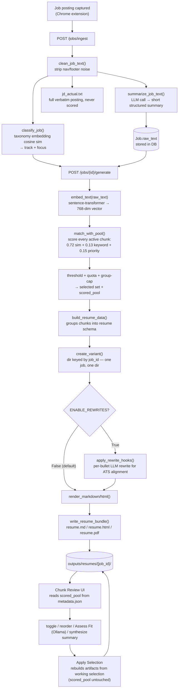
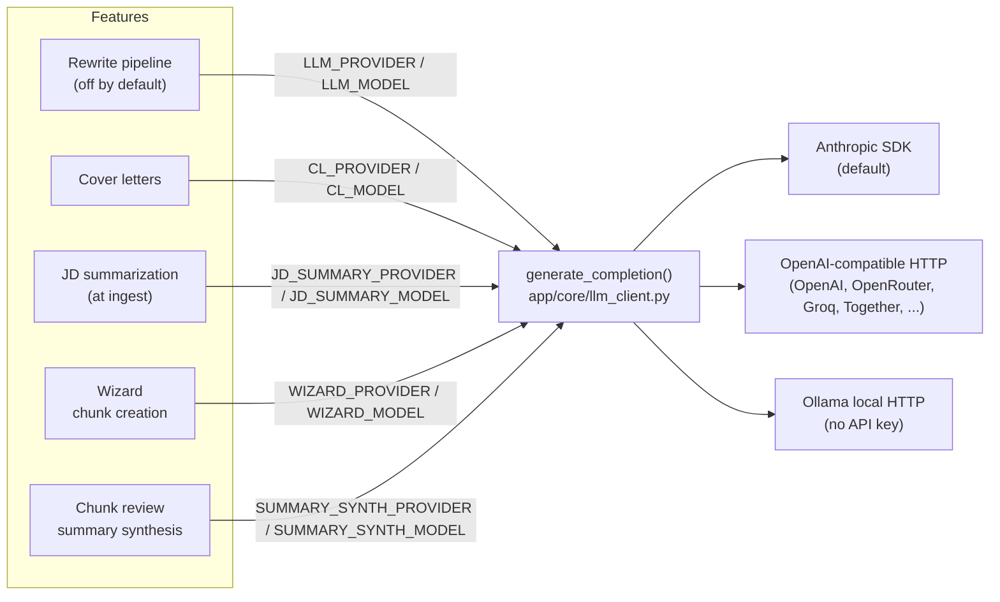

# jobfitcv — System Internals

Reference doc for understanding how the pipeline actually works before making assumptions or changes.

---

## Pipeline flow (end to end)



---

## LLM provider architecture (`app/core/llm_client.py`)

Every LLM-touching feature routes through one function, `generate_completion()`, which is provider-agnostic and independently configurable per feature — switching one feature's provider never affects another's.



Each feature's `*_PROVIDER`/`*_MODEL` pair defaults to Anthropic and its own pre-existing model choice — nothing changes behavior unless you explicitly set a variable. See `.env.example` for the full list.

**Separately, not part of this system:** the chunk-review "Assess Fit" feature calls Ollama's HTTP API directly (`_ollama_assess()` in `chunk_review.py`), not through `generate_completion()` — it has no provider option, Ollama only.

---

## Track classification (`taxonomy_classifier.py`)

- Embeds the job text, cosine-sims against every `.npy` file in `data/taxonomy/`
- Picks the highest-scoring file → splits on `_` to get `track` + `focus`
- Splits the winning filename on the first `_` to derive the short track name: `cloud_devops.npy` → `"cloud"`, `ai_ml.npy` → `"ai"`, `soc_security.npy` → `"soc"`. Summary chunks' `track` field must use these short names.
- Available tracks: `soc`, `sysadmin`, `backend`, `cloud`, `it`, `ai` (derived from `.npy` filenames: `soc_security`, `sysadmin_itops`, `backend_api`, `cloud_devops`, `it_support` → `it`, `ai_ml`)
- Track classification affects TWO things only: (1) which summary chunks are eligible, (2) variant reuse gate (see below)

---

## Chunk scoring (`matcher.py`)

**What track affects:**
- `filter_summaries_by_track()` removes summary chunks where `chunk.track != None AND chunk.track != current_track`
- Only summary chunks are track-filtered. Experience, project, skill, education all compete regardless of track.

**Scoring formula (per chunk):**
```
final_score = 0.72 * cosine_similarity(job_vec, chunk_vec)
            + keyword_weight * keyword_overlap_score
            + 0.15 * (chunk.priority / 10)
```
- `keyword_weight` = 0.13 for all chunk types (skills included)
- `keyword_overlap_score` = min(matching_tokens / 4, 1.0)

**Keyword overlap — how tags and keywords feed in:**
```python
tag_text   = " ".join(t.replace("-", " ") for t in chunk.get("tags", []))
kw_text    = " ".join(chunk.get("keywords", []))
chunk_terms = extract_keywords(f"{tag_text} {kw_text}")
```
Hyphens in tags are split to spaces BEFORE `extract_keywords`, so `aws-security` → `aws` + `security`. Tags and keywords compete equally. Job text goes through the same `extract_keywords` normalization on its side.

**`extract_keywords` survival rules:**
- Lowercased, punctuation stripped
- Alias map applied (e.g. `ad` → `directory`, `containers` → `docker`)
- KNOWN_TERMS: always kept regardless of length (includes `iam`, `mfa`, `ai`, `ml`, `soc`, etc.)
- STOPWORDS: dropped
- Everything else: kept if `len >= 3`
- Tokens starting with a digit: dropped

**Thresholds (via `_threshold(chunk_type)` in matcher.py):**
- Skill chunks: `SKILL_MIN_SCORE = 0.43`
- Education chunks: `EDUCATION_MIN_SCORE = 0.44` — edu chunks score ~0.47–0.49 on target tech JDs (clear threshold); retail/unrelated JDs score much lower and are cut naturally, avoiding overqualification signal
- All other chunks: `MIN_SCORE = 0.50`
- Pool floor: `POOL_FLOOR = 0.35` — chunks below this don't appear in chunk review at all
- If nothing passes threshold, top 2 by score are taken as fallback

**Quotas (after threshold filter):**
```python
QUOTAS = { "experience": 5, "project": 5, "skill": 20, "summary": 1, "education": 2 }
```
Within each type, top N by score are taken. `GROUP_CAP = 3` — max bullets from any single `group_key` in experience or project pools.

**Education ordering:** sorted by `priority` descending in `build_resume_data()` — not by score. This ensures chronological (most recent / highest priority) ordering regardless of which job the resume is for.

---

## Summary chunk selection

Each summary chunk has a `track` field (or `None` for universal) and a `priority`. At generation time, `filter_summaries_by_track()` keeps only chunks whose track matches the job's classified track plus any universal ones, then the scorer ranks among the survivors exactly like any other chunk type — cosine similarity dominant, priority a secondary boost, quota capped at 1.

**A broad/universal summary tends to beat track-specific ones on generalist postings.** A summary chunk written to span several adjacent tracks sits closer to the embedding centroid of postings that touch on all of them, so it can consistently outscore a narrowly-focused track-specific summary in cosine similarity — even when the track-specific one is the better narrative fit. Priority alone usually can't close that gap, since every chunk shares the same max priority ceiling. A track-specific summary only pulls ahead on a posting that's heavily specialized in that track's language.

To make a track-specific summary win more often: give it a meaningfully higher priority relative to the universal fallback, or restructure the scorer to hard-prefer track-matched summaries over universal ones regardless of raw similarity.

---

## Variant creation (`variant_manager.py` + `generation_pipeline.py`)

**No reuse detection exists in the current code.** Earlier versions of this app compared new jobs against existing variants by cosine similarity + Jaccard keyword overlap and shared a single output directory across matching jobs (`{track}_{focus}_v{N}` naming, thin reference DB rows, a `reused` flag). That system was removed — confirmed 2026-09 by reading `variant_manager.py` and `jobs.py` directly; no cosine/Jaccard comparison exists anywhere in the codebase. It will not be coming back. The `reused` column still exists on the `Variant` table but nothing sets it to `1` anymore — vestigial.

**Current behavior, much simpler:**
- Every ingested job gets a UUID `job_id` (`uuid.uuid4()`).
- `create_variant(job_id, ...)` creates a directory keyed directly by that `job_id` — **one job, one directory, always.**
- `POST /jobs/{job_id}/generate`: if a variant already exists for that `job_id`, returns it as-is (no re-run). With `?force=true`, deletes the existing output directory + DB row, then runs the full pipeline again to produce a fresh variant at the same path.
- No shared directories between jobs, no version-number suffixes, no reference rows — each job's artifacts are fully independent.

---

## Artifact layout

```
outputs/resumes/{job_id}/
  job_embedding.npy       # job vector used for scoring + future reuse detection
  metadata.json           # track, focus, chunk_ids, job_keywords, job_preview, artifacts
  generated/
    resume.md
    resume.html
    resume_data.json      # structured resume object (the builder output)
  edited/
    resume.edited.md      # seeded from generated, user edits land here
  rewrites/
    pending_rewrite.json  # current rewrite session diff
    diff_*.json           # timestamped saved diffs (up to 10)
```

---

## Known gaps / quirks

- **Review summary chunks periodically for staleness** — a summary's framing can predate your current focus as target roles shift; if one no longer represents you, set `active:false` in the wizard rather than leaving it to compete in scoring.
- **A universal summary chunk tends to dominate for generic JDs** — see Summary chunk selection above; track-specific summaries only win when the JD is heavily specialized.
- **Server reload (watchfiles) kills in-progress generation** — uvicorn `--reload` restarts the process when any watched file changes mid-generation. Job status stays `"generating"` in the DB forever. Fix: `UPDATE jobs SET status='ingested' WHERE id='...'` in SQLite, then re-trigger.
- **Tag keyword overlap limited by job text** — adding tags to chunks only helps if the job posting actually uses those terms. Tags don't affect embedding similarity, only the `0.13 * keyword_score` component.
- **Near-miss chunks visible in chunk review** — pool floor 0.35 means chunks in the 0.35–0.50 range appear in the Dropped tier and can be manually toggled in.
